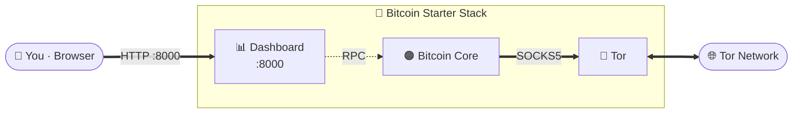

<div align="center">

# Bitcoin Starter Stack

### Private Bitcoin full node, routed over Tor

Docker Compose stack for a [Bitcoin Core](https://bitcoincore.org/) full node with all P2P
traffic routed through a built-in Tor daemon, plus a lightweight web dashboard for
watching sync progress, peers, and disk usage.


</div>

---

## What it does

- 🟠 **Full Bitcoin node.** Bitcoin Core v28 validating the full chain, data persisted on disk
  across restarts.
- 🧅 **Tor-only networking.** All outbound P2P connections go through the Tor container
  (`onlynet=onion`) — your home IP is never associated with your node. No inbound
  connections, no clearnet.
- 📊 **Live dashboard.** Sync progress, block height, peer counts, uptime, and disk usage on
  your LAN at port `8000`, auto-refreshing. RPC stays inside the Docker network — nothing
  but the dashboard port is exposed.
- 🔑 **Credentials out of git.** `configure.sh` renders your RPC credentials from
  `config.json` into a gitignored `.env`; no tracked file is ever edited.

## How it works



Three services on an isolated Docker network: `tor` (SOCKS5 proxy), `bitcoin` (Bitcoin Core,
non-root, RPC reachable only from inside the network), and `dashboard` (Flask app polling
the node over RPC).

## 🚀 Quick Start

**Prerequisites:** Ubuntu Server 24.04 with [Docker Engine](https://docs.docker.com/engine/install/ubuntu/)
(and the [post-install steps](https://docs.docker.com/engine/install/linux-postinstall/)),
`jq`, an SSD with ~1 TB free (the chain is ~800 GB and grows), and 8 GB+ RAM.

Optional but handy — `avahi-daemon` lets you reach the dashboard at `<hostname>.local`:

```bash
sudo apt install jq avahi-daemon
```

**1. Clone and configure.** Set your own RPC username and password in `config.json`
(stick to letters and numbers — no special characters):

```bash
git clone https://github.com/VijitSingh97/bitcoin-starter-stack.git
cd bitcoin-starter-stack
nano config.json    # set node_username and node_password
./configure.sh      # writes .env, creates the data dir
```

**2. Start the stack:**

```bash
docker compose up -d
```

**3. Watch it come up:**

```bash
docker logs -f tor        # wait for "Bootstrapped 100% (done)"
docker logs -f bitcoin    # headers, then block sync
```

The initial block download is several hundred GB over Tor — expect it to take days.
The dashboard shows live progress the whole time.

## 📈 Monitoring

Open the dashboard at `http://localhost:8000`, or from another machine on your LAN at
`http://<hostname>.local:8000` (run `hostname` on the node box to get it).

- **Sync progress** — block height vs. headers, with a progress bar.
- **Peers** — total connections, inbound vs. outbound.
- **Disk** — chain size on disk vs. drive capacity.

The dashboard has no authentication — it's meant for your LAN only. Don't port-forward
`8000` to the internet.

## ⚠️ Disclaimer

**USE AT YOUR OWN RISK.** This software is provided "as is" without any warranties. Running
a full node is resource-intensive (bandwidth, disk, memory). Understand your firewall setup
before exposing anything beyond your LAN.
