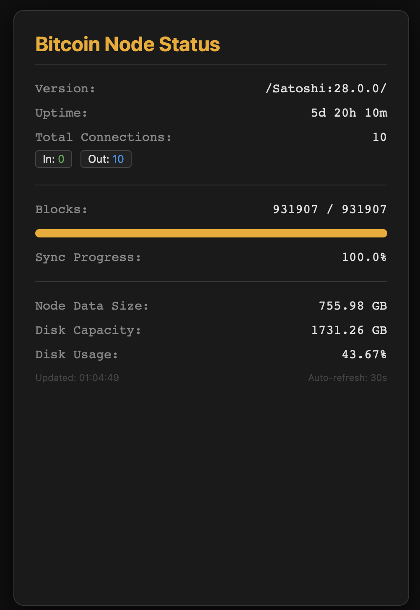

<div align="center">

# Bitcoin Starter Stack

### Private Bitcoin full node, routed over Tor

[](https://github.com/VijitSingh97/bitcoin-starter-stack/actions/workflows/ci.yml)
[](./LICENSE)


Docker Compose stack for a [Bitcoin Core](https://bitcoincore.org/) full node with all P2P
traffic routed through a built-in Tor daemon, plus a lightweight web dashboard for
watching sync progress, peers, and disk usage.



</div>

---

## What it does

- 🟠 **Full Bitcoin node.** The official Bitcoin Core image (digest-pinned, Dependabot-updated)
  validating the full chain, health-checked by Docker — or a **pruned node** in ~30 GB via one
  config key.
- 🧅 **Tor-only networking.** All P2P traffic goes through the Tor container
  (`onlynet=onion`) — your home IP is never associated with your node. Outbound-only by
  default; opt in to an **inbound onion service** to serve blocks back to the network,
  still without exposing your IP.
- 📊 **Live dashboard.** Sync progress, peers, uptime, pruned status, and disk usage (with a
  low-space warning) on your LAN at port `8000` — optionally behind basic auth. RPC stays
  inside the Docker network; nothing but the dashboard port is exposed.
- 🔑 **Credentials handled properly.** Config renders into gitignored files, so a stray
  `git add` can't publish your RPC password — and bitcoind itself gets only a salted
  `rpcauth` hash, never the plaintext.
- ♻️ **Reuse an existing chain.** Point `data_dir` at an already-synced datadir and skip
  the multi-day initial download.
- 📟 **Opt-in alerts & remote access.** Telegram alerts (node down, sync complete, disk
  low), a [Healthchecks.io](https://healthchecks.io/) dead-man's switch for when the whole
  box goes dark, and dashboard access from anywhere via a Tor onion service — all routed
  over Tor. See [Notifications](docs/notifications.md).

## 🚀 Quick Start

**Prerequisites:** Ubuntu Server 24.04 with [Docker Engine](https://docs.docker.com/engine/install/ubuntu/),
`jq`, an SSD with ~1 TB free (the chain is ~800 GB and grows — or ~30 GB
[pruned](docs/configuration.md#pruned-node)), and 8 GB+ RAM.
Details in [Hardware Requirements](docs/hardware.md).

```bash
git clone https://github.com/VijitSingh97/bitcoin-starter-stack.git
cd bitcoin-starter-stack   # or unpack the tarball from the latest release
cp config.example.json config.json
nano config.json    # set node_username and node_password (letters/numbers only)
./configure.sh      # writes .env, creates the data dir
docker compose up -d
```

Then watch it come up:

```bash
./stack status            # container + health summary
./stack logs tor          # wait for "Bootstrapped 100% (done)"
./stack logs bitcoin      # headers, then block sync
```

`./stack` wraps day-to-day operations (`up`, `down`, `logs`, `status`,
`doctor`, `apply`, `backup`/`restore`) — see [Operations](docs/operations.md).

The initial block download is ~800 GB over Tor — expect days, with live progress on the
dashboard the whole time. Full walkthrough: [Getting Started](docs/getting-started.md).

## 📈 Monitoring

Open the dashboard at `http://localhost:8000`, or from another machine on your LAN at
`http://<hostname>.local:8000` (needs `avahi-daemon` on the node box).

- **Node mode** — a **Full** or **Pruned** badge in the header.
- **Sync progress** — block height vs. headers, with a progress bar.
- **Peers** — total connections, inbound vs. outbound.
- **Disk** — chain size on disk vs. drive capacity.
- **Versions** — Bitcoin Core version in the card, stack version in the footer.
- **Theme** — follows your system light/dark setting; the top-right toggle cycles
  Auto → Light → Dark and remembers your choice.
- **Live tower** — a 5×5 isometric tower of blocks rises endlessly behind the card in
  the bitcoin accent. Decorative, theme-aware, and paused for `prefers-reduced-motion`.

The dashboard has no authentication — it's meant for your LAN only. Don't port-forward
`8000` to the internet.

## 🏗️ How it works


Three services on an isolated Docker network: `tor` (SOCKS5 proxy), `bitcoin` (Bitcoin Core,
non-root, RPC reachable only from inside the network), and `dashboard` (Flask app polling
the node over RPC). Full breakdown in [Architecture](docs/architecture.md).

## 📚 Documentation

| Guide | What's inside |
|---|---|
| [Getting Started](docs/getting-started.md) | Prerequisites, install, first start, what to expect during sync. |
| [Hardware Requirements](docs/hardware.md) | CPU, RAM, disk sizing — with real numbers from a reference box. |
| [Configuration](docs/configuration.md) | Every `config.json` key, applying changes, reusing an existing node. |
| [Architecture](docs/architecture.md) | The three services, network layout, and privacy model. |
| [Operations](docs/operations.md) | Commands, health checks, upgrades, backup, troubleshooting. |

## 🧪 Testing

```bash
tests/run.sh
```

Runs shellcheck, a `configure.sh` end-to-end test, a docker-compose contract test, and the
dashboard's unit tests — the same suite [CI](.github/workflows/ci.yml) runs on every push,
plus a full image build. See [CONTRIBUTING.md](CONTRIBUTING.md).

## ⚠️ Disclaimer

**USE AT YOUR OWN RISK.** This software is provided "as is" without any warranties. Running
a full node is resource-intensive (bandwidth, disk, memory). Understand your firewall setup
before exposing anything beyond your LAN. Security posture and reporting:
[SECURITY.md](SECURITY.md). Licensed [MIT](LICENSE).
