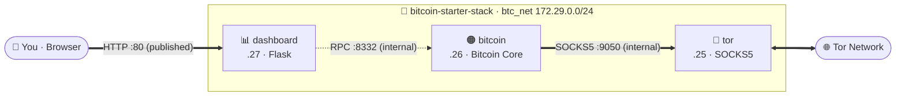

# Architecture

Three containers on one isolated bridge network (`btc_net`,
`172.29.0.0/24`), orchestrated by a single compose file.

## The services

| Service | Image | Runs as | Role |
|---|---|---|---|
| `tor` | `alpine:3.22` + tor (built locally) | `tor` user | Outbound SOCKS5 proxy at `172.29.0.25:9050`. Fresh onion identity per volume. |
| `bitcoin` | [`bitcoin/bitcoin`](https://hub.docker.com/r/bitcoin/bitcoin) (official, digest-pinned) | `1000:1000` | Full or pruned node. `-datadir=/data` bind-mounted from the host. Credentials, `dbcache`, and `prune` injected from `.env` at runtime. |
| `dashboard` | `python:3.11-slim` + Flask (built locally) | root (container) | Polls the node over RPC every page load; reads the data dir read-only for disk stats. |

Static IPs keep `bitcoin.conf`'s `proxy=` line and the dashboard's RPC URL
simple and deterministic.

## Privacy model

- **`onlynet=onion` + `proxy=` + `listen=0`** in
  [bitcoin.conf](../build/bitcoin/bitcoin.conf): every P2P connection is
  outbound, to an onion peer, through the tor container. The node never
  dials clearnet and, by default, never accepts inbound.
- **Optional inbound onion service** (`inbound_onion` in `config.json`):
  bitcoind registers an onion address over tor's cookie-authed control
  port and serves blocks to the network — still no clearnet, no host port,
  no IP exposure. The tor data volume is mounted read-only into the
  bitcoin container (whose process joins tor's group) so it can read the
  control-auth cookie.
- **RPC auth is a salted hash.** bitcoind is started with `rpcauth=`; the
  plaintext password exists only in the dashboard container and `.env`.
  The bitcoin health check authenticates with Core's `.cookie` file.
- **The only published port is the dashboard's `80`.** RPC (`8332`),
  SOCKS (`9050`), and the tor control port (`9051`) exist only on the
  internal network; `rpcallowip` restricts RPC to Docker's address space
  as a second layer. The optional dashboard onion service adds reachability
  through Tor only — still no host port.
- **Notification egress rides Tor too.** Telegram messages and
  Healthchecks.io pings (both opt-in) go through the tor container's SOCKS
  proxy (`socks5h`, so even DNS resolves through Tor) — enabling alerts
  never turns the stack into a clearnet beacon.

## Trust boundaries — and non-boundaries

- The dashboard has **no authentication**. LAN exposure is the feature;
  internet exposure is on you not to configure. See
  [SECURITY.md](../SECURITY.md).
- Docker host access is **not** a boundary: `docker inspect` reveals RPC
  credentials. Anyone who can run Docker commands owns the box anyway.

## Startup behavior

The bitcoin entrypoint deletes stale `*.lock`/`LOCK` files before starting
bitcoind — recovery from hard power-offs, safe because `container_name`
guarantees a single instance. `stop_grace_period: 5m` gives Bitcoin Core
time to flush its cache on shutdown; don't `docker kill` it.
